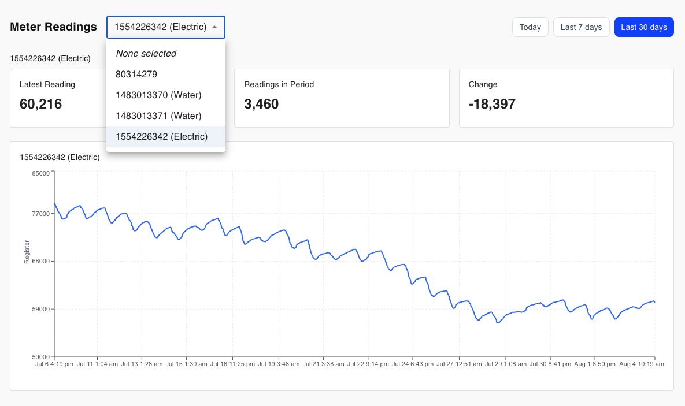

# OpenAMR

An application for reading and monitoring utility meter data.



## Requirements

1. A USB RTL-SDR dongle
2. A linux machine 

## Architecture

The application consists of three components:

- A rest API written with Python/Django for saving and retrieving data
- A daemon that listens for AMR signals, decodes the data and sends it to the API for storage
- A frontend UI for charting out the meter usage.

## Installation

1. Clone this repo:

```
git clone https://github.com/ryanbagwell/meter-reading
```

2. Run the install script (requires root)

```
cd meter-reader && sudo ./install/setup.py
```

## Inspiration

This is a long-desired project of mine that was made possible by AI tools. Years ago I developed a
similar app that leveraged [the rtlamr project](https://github.com/bemasher/rtlamr), a command-line tool that
recieves and decodes AMR signals via an RTLSDR dongle. The tool would only print data to the command line,
however, which wasn't ideal for reading and processing the data into a database. Fast forward to today,
and Claude allowed me to port that project into a Python-based utility that handles the decoding and posts
the data to an API endpoint of your choice.

